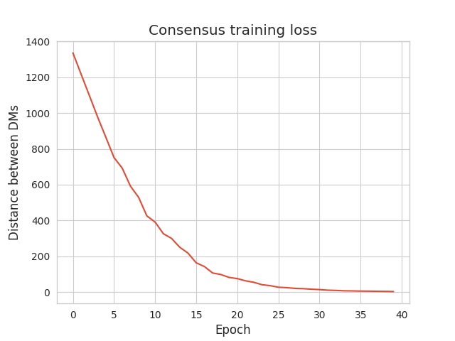
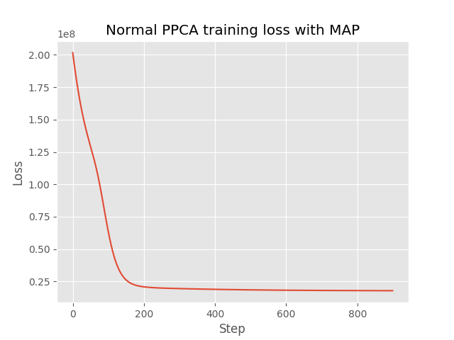
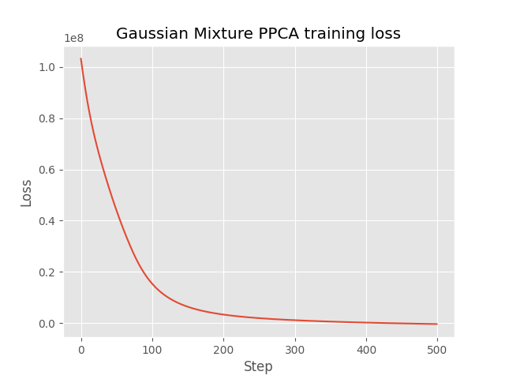
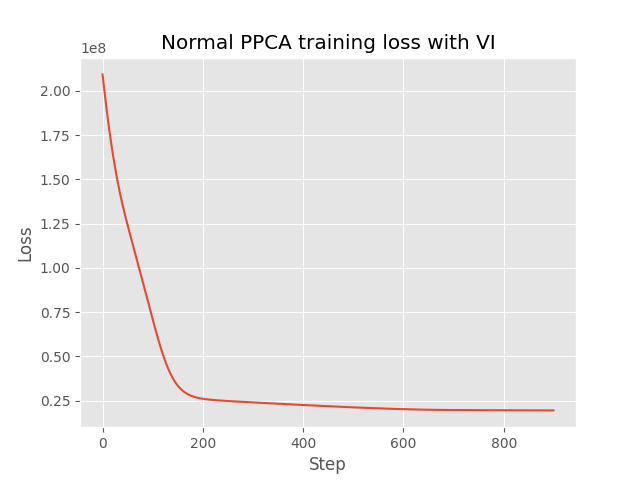
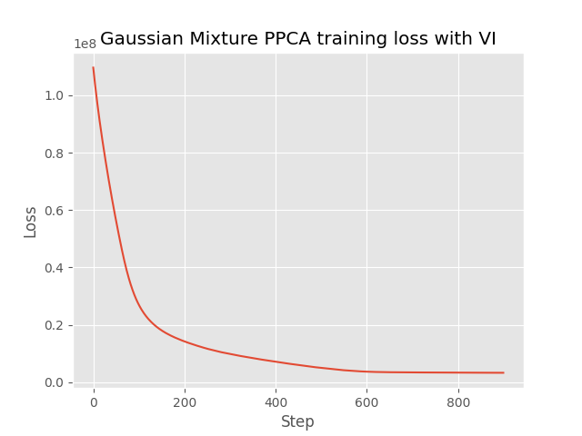
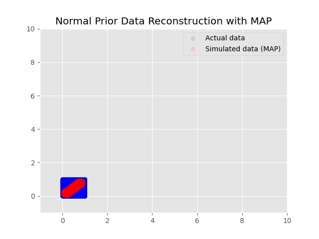
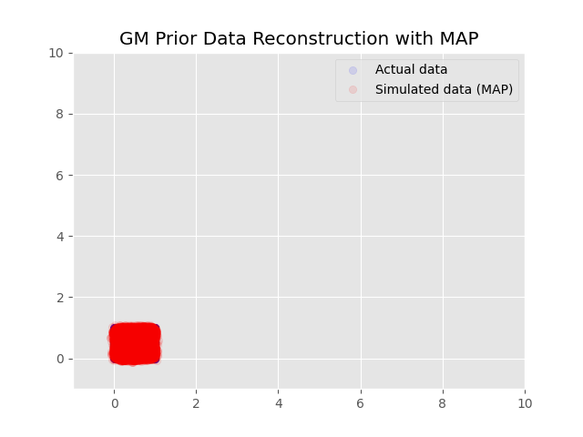
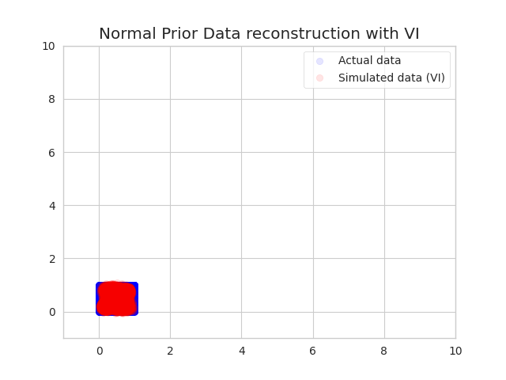
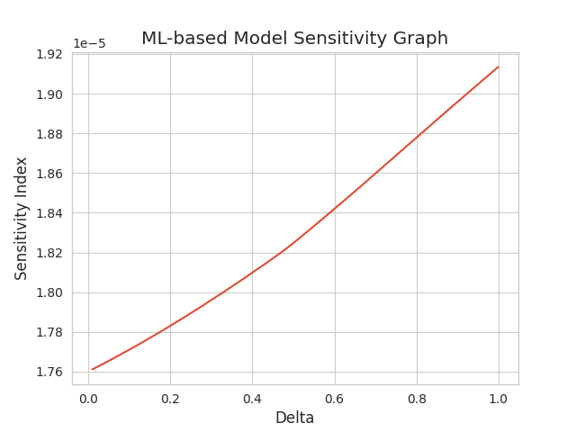
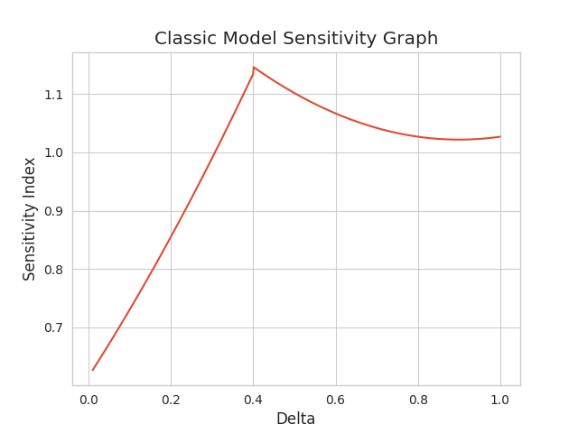

# ⚖️ Multicriteria Decision Making : A comparative study of the classical Dempster-Shaper Theory-based Analytic Hierarchy Process (DS/AHP) and its Modern ML-based Approach using Probabilistic Principal Component Analysis (PPCA).

## Abstract
The Analytic Hierarchy Process (AHP) (Saaty, 1977) is a decision-making framework designed to help decicion makers (DMs) rank or prioritize alternatives, sort information based on multiple criteria via criteria and alternatives pairwise  comparison and decision makers consensus building. A recent advancement, the DS/AHP method, merges Dempster-Shafer theory with AHP, enabling judgments on groups of decision alternatives (DA) while incorporating a measure of uncertainty in the final results. Using the Dempster-Shaper Theory(DST), one can tap into its power of multiple evidence sources combination through the famous Dempter's rule of combination. 

Despite its strengths, DS/AHP lacks a proper and well-defined mathematical structure, making it cumbersome and difficult to manage as the number of criteria and alternatives grows. Plus, evaluating decisions based on multiple, often **conflicting**, criteria can possibly output erroneous results. This study shifts focus toward a modern latent-based approach, blending certain aspects of the classical DS/AHP method and some state-of-art Machine Learning (ML) techniques. However, We first take a helicopter view of the DS/AHP method to provide a high-level overview of DS/AHP to ensure accessibility by abstracting away the more granular and nitty-gritty details in order to keep every reader from getting overwhelmed and confused. This will help you get a better grasp of the intuition underpinning the whole process before transitioning into the Machine Learning paradigm, leveraging Probabilistic Principal Component Analysis (PPCA) and Variational Autoencoders (VAEs). The actual study aims to evaluate how these methods perform in terms of **feature extraction, decision-making accuracy, sensitivity to different scenarios and computational efficiency**, ultimately assessing how ML-based approaches offer a viable alternative to the traditional DS/AHP.

***keywords : Bayesian theory, Basic Probability assignment, Gaussian Mixture, Variational inference, Variationan Autoencoders, Dempter-Shafer Theory, Pairwise comparison, Maximum A Posteriori (MAP), Probabilistic Principal Component Analysis, CNNs, Multicriteria Decision Making, Decision Alternative or Alternative, Criteria.***

## I. Introduction
Decision making processes involving multiple conflicting criteria inevitably requires a systematic and logical information structuring; the consideration of evidence based on several criteria is crucial for handling uncertainty and imprecise information. The Analytic Hierarchy Process (AHP) is one of techniques used by decision-makers (DMs), when it comes to choosing the best alternatives (for example, choosing 25 best candidates among 2000 for scholarship awards) subject to multiple criteria, to rank alternatives through pairwise comparisons by assigning weights (usually using the 1-9 Saaty's scale) based on their relative importance. Over time, enhanced AHP methods have been introduced to improve its ability to handle uncertainty and tackle ambiguity in human decisions. One such improvement is Dempster-Shafer AHP (DS/AHP), the method proposed by Malcom Beynon, which incorporates Dempster-Shafer Theory (DST) in AHP. This combination allows decision-makers to express degrees of belief over a set of alternatives, rather than forcing them into assigning strict probability to each alternative. By using Dempster's rule of combination, DS/AHP aggregates evidence from multiple sources (DMs), offering a more flexible decision-making framework. 

While DS/AHP offers a better bayesian-extended mechanism for handling uncertainty, its mathematical rigidity hinders scalability, making it difficult for optimizations. More critically, decision-making processes often involve complex and high-dimensional data, which traditional AHP approaches, by entirely relying on expert-defined decisions, may struggle to manipulate effectively. These challenges have led researchers to explore modern, data-driven approaches, particularly in the field of Machine Learning (ML). The work of [Ibrahim Yilmaz, Aylin Adem, Metin Dağdeviren, 2023](https://www.sciencedirect.com/science/article/pii/S2352152X23013385) showcased a ML-integrated multi-criteria decision-making approach based on consensus for selection of energy storage locations.

This study investigates the synergy between the traditional **DS/AHP** and some Machine Learning principles in order to redefine multi-criteria decision-making. The main objective is to utilise the power of PPCA and VAES to capture hidden structures in high-dimensional data and learn intrinsic relationships within the data subject to criteria. By integrating Machine Learning , we aim to go past the barriers set by those traditional settings, potentially improving efficiency, scalability, and decision accuracy through sensitivity analysis. Let's have fun by making informed decisions!

## Prerequisite knowledge
Before moving forward with this study, it's crucial for every reader to kwow that prior necessary background knowledge in some aspects of Mathematiques and Machine learning is required. This section presents an overview of those key concepts (core mathematical formulations and the tools used for their implementations) everyone should wrap one's head around to ensure accessibility and clarity : 

* Tensorflow and Tensorflow probability basics;
* Probability distributions and bayesian inference;
*  Mixture Models & Gaussian Mixture Models (GMMs) : **soft clusturing**;
* Variational inference;
* The classical Principal Component Analysis (PCA) : A **dimensionality reduction** technique that transforms high-dimensional data into a lower-dimensional representation while preserving variance. An extended probabilistic version will be used here;
* Variational Autoencoders (VAEs) : a class of **generative models** that encode data into a **latent space** and reconstruct it using a **probabilistic** framework;
* Machine Learning and optimizations ;


Other background understandings are implied but non-negligeable. {Joke} There is no mention of DST or DS/AHP because the brief overview presented afterwards will be enough to stay synced.
## I. Case of study

### I.1. Problem Statement: Optimizing Scholarship Award Allocation

- **Context**:

A prestigious educational instituion has received an overwhelming number of applications for its annual scholarship program. This year, the foundation aims to award 100 scholarships to exceptionally deserving candidates from a total of 45,000 applicants. The selection process must be rigorous, transparent, and fair, ensuring that the scholarships are allocated to those who best align with the institution's mission, requirements and values.

- **Challenge**:

The overwhelming volume of applications and the complexity of evaluating candidates based on diverse criteria necessitate a strong and efficient decision-making framework. To ensure an equitable distribution of scholarships, the foundation has invited 10 decision-makers, each with expertise in different areas relevant to the scholarship criteria.

- **Objective**:

Develop and implement a multicriteria decision-making algorithm that:

$\checkmark$ Evaluates 45,000 scholarship applications based on 12 pre-defined criteri;<br>
$\checkmark$ Facilitates the consensus-building process among 10 decision-makers;<br>
$\checkmark$ Identifies the 100 most deserving candidates who best satisfy the weighted criteria;<br>
$\checkmark$ Provides a clear and justifiable ranking of all applicants;<br>
$\checkmark$ Handles potential inconsistencies and conflicts in DMs' evaluations.<br>

- **Criteria**:

The 12 evaluation criteria are as follows:

$\checkmark$ Academic Merit: Cumulative GPA;<br>
$\checkmark$ Extracurricular Involvement: Participation in organizations, and volunteer activities;<br>
$\checkmark$ Leadership Potential;<br>
$\checkmark$ Community Impact;<br>
$\checkmark$ Innovation and Creativity;<br>
$\checkmark$ Financial Need;<br>
$\checkmark$ Personal Statement Quality: Clarity, and persuasiveness of the applicant's personal statement;<br>
$\checkmark$ Letters of Recommendation;<br>
$\checkmark$ Alignment with Foundation's Mission;<br>
$\checkmark$ Research Potential;<br>
$\checkmark$ Communication Skills;<br>
$\checkmark$ Diversity and Inclusion.<br>

## II. Prior Analysis
While this section may appear straightforward to some, these fundamental details provided are essential for downstream tasks.
### II.1. Estimating Decision Makers Priority Values (DMPVs)

Decision Maker Priority Values (**DMPVs**) represent the relative influence of each Decision Maker (**DM**) in the final decision. They are sort of decision makers weights which determine how high is the impact of each DM in a Decision Making process (DMP). If you're familiar with **GMMs**, drawing an analogy to them, DMPVs in **DS-AHP** serve a role similar to **mixing coefficients** in GMMs, determining the contribution of each component (DM) in the aggregation process. 

These values can be derived under the frequentist paradigm as well as updated using the bayesian approaches. Under the frequentist probability framework, we can view a Decision Making process (DMP) that a DM participates in as a random sample from some larger, potentially hypothetical population of DMPs. We can then make a probability statement i.e long-run frequency statements based on this larger population. However, Bayesian inference provides a more **adaptive and probabilistic** way of updating our beliefs about a DM’s competence based on prior knowledge and observed data.

#### II.1.1. Bayesian Inference for DMPVs

Suppose a particular decision maker, $DM_i$, has participated in $n$ decision-making processes, of which $k$ were deemed "good" decisions and $n - k$ were considered "bad." Our goal is to estimate $\theta_i$, the probability that $DM_i$ makes a good decision in any given DMP. Some may  

##### II.1.1.1. Prior Belief
We start with a **prior distribution** over $\theta_i$, which represents our initial belief about the DM’s competence before observing any decisions. We'll make a common choice, the **Beta distribution** (This choice is not random):

> $P(\theta_i) \sim \text{Beta}(\alpha, \beta)$

where:  
- $\alpha$ represents prior successes (belief in competence).  
- $\beta$ represents prior failures (belief in incompetence).  

##### II.1.1.2. Likelihood Function
Given $k$ good decisions out of $n$, we assume a **Binomial likelihood**:

> $P(D \mid \theta_i) = \text{Binomial}(k \mid n, \theta_i) = \binom{n}{k} \theta_i^k (1 - \theta_i)^{n-k}$

##### II.1.1.3. Posterior Update (Bayes' Rule)
Applying **Bayes’ theorem**, we obtain the posterior distribution of $\theta_i$:

> $P(\theta_i \mid D) \propto P(D \mid \theta_i) P(\theta_i)$

Since the **Beta distribution** is a conjugate prior for the **Binomial likelihood**, the posterior also follows a **Beta distribution**:

> $P(\theta_i \mid D) = \text{Beta}(\alpha + k, \beta + (n - k))$

##### II.1.1.3 Posterior mean
This distribution encapsulates our **updated belief** about $DM_i$'s competence based on past performance. The expected value of $\theta_i$, representing the most likely estimate of $DM_i$'s probability of making a good decision, is given by:

> $E[\theta_i] = \frac{\alpha + k}{\alpha + k + \beta + (n - k)}$

#### II.1.2. DMPV calculation
Let's refer to $E[\theta_i]$ as $\mu_i$ for simplicity. Once the expected values $\mu_i$ of $\theta_i$ for all $N$ DMs have been computed, the **Decision Maker Priority Values (DMPVs)**, denoted as **$DMPV(i)$** for the **$DM$** $i$, are then calculated as follows :

> $DMPV(i) = \pi_i = \frac{\lambda_i \times \mu_i}{\sum_{k = 1}^{N} \lambda_k \times \mu_k}$;

Where : 
* $\lambda_i \in [0, 1]$ is a hyperparameter termed the experience coefficient. The higher the number of DMPs the DM has participated in, the closer $\lambda_i$ value is from $1$. The general idea behind this trick is that the most experienced DMs are more likely to be trusted.

This normalizing trick ensures that the DMPVs over all DMs sum to 1 : $\sum_{k = 1}^N \pi_k = 1$.

#### II.1.3. Example 
Suppose $DM_i$ has participated in $n = 15$ decision-making processes, yielding $k = 7$ good decisions and $8$ bad ones. If we assume a **uniform prior** $\alpha = 1, \beta = 1$, the posterior distribution becomes:

$P(\theta_i \mid D) = \text{Beta}(1 + 7, 1 + 8) = \text{Beta}(8,9)$

$E[\theta_i] = \frac{\alpha + k}{\alpha + k + \beta + (n - k)} = \frac{8}{8+9} = \frac{8}{17} \approx 0.47$

This suggests that $DM_i$ has an updated estimated probability of **47%** of making a good decision in future DMPs.

### II.2. Estimating Criteria Priority Values (CPVs)
A profound transformation in multicriteria decision-making methodologies has been observed when the notion of consensus building was integrated. Like DMPVs, Criteria Priority Values serve  as **weighting factors** that quantify the contribution of each criterion to the final decision. As such, they possess the following properties : 

***Non-Negativity***
> $CPV(j) \geq 0, \quad \forall j$

***Normalization***: 
> $\sum_{j=1}^{m} CPV(j) = 1$

Where $m$ is the total number of criteria.

CPVs can be estimated using various methodologies, including **expert judgment (AHP models), statistical learning approaches, and probabilistic modeling**. This study, making use of the consensus-based expert judgments to derive those values through criteria pairwise comparisons, aims to keep the balance between the classical methods and their modern derivatives. 
An algorithm explaining these steps will be provided. However, it is essential to establish some key terminologies that underpin this process. 

During the DMP, each DM performs a **pairwise comparison** of all criteria using the **1-9 scale value**. This results in a $m \times m$ matrix ($m$ for the total number of criteria), commonly known as Pairwise Comparison Matrix (PCM). For the purpose of implementation in this study, the PCM will be referred to as Pairwise comparison Tensor (PCT).

#### II.2.1. The 1-9 Scale Value
The 1-9 Scale Value, also called Saaty's scale, is an integer-based scoring system used to compare criteria in a structured manner. When comparing a criterion $i$ to a criterion $j$, the scale is interpreted as follows :

 * A score of **1** indicates that the two criteria are equally important.  
 * A score greater than **1** (**2 to 9**) expresses the relative priority of criterion $i$ over criterion $j$.  
 * A reciprocal value (e.g., $1/a, a = 2...9$, if criterion $j$  is thought to be more important than criterion $i$) is used for **consistency** in comparisons.  
For problems with a higher number of criteria, this scale can be expanded.

#### II.2.2. Pairwise Comparison Tensor (PCT)
A **PCT** is a structured $m \times m$ **tensor** that encodes the comparisons made by a **DM**. It is mathematically defined by the following properties:

***Positivity***
> $PCT(i,j) > 0 \quad \forall i, j$;

***Identity Property***
> $PCT(i,i) = 1 \quad \forall i$;

A criterion compared to itself always has a score of **1**.

***Reciprocity***
> $PCT(i,j) =  \frac{1}{PCT(j, i)}$;

This suggests that if criterion $i$ is considered **x** times more important than $j$, then $j$ must be **( 1/x )** times as important as $i$.

#### II.2.3. Consensus-based CPV estimation algorithm
Consensus building is a weel-established concept in the realm of decision making. It refers to a collaborative process in which a group of DMs set their mind to achieve a broad acceptance on the best option by actively working together,  ensuring that all stakeholders' perspectives are considered while addressing potential disagreements through **discussion and compromise**, aiming for a decision that most can support. In some cases, individuals may choose to "stand aside," signaling that while they may not fully lean to the decision, they do not actively oppose it. Consensus is typically achieved when **all or nearly all** members of the group **assent to a decision**, even if some may not fully agree with every aspect of it. 

Over the years, various methods have been developed to build consensus in **Multi-Criteria Decision-Making**. [(You, X., Hou, F. & Lou, Z.)](https://doi.org/10.1007/s12559-021-09913-x) proposed a Consensus Building approach in Multi-criteria Group Decision-Making using **Single-Valued Neutrosophic Sets (SVNS)** to account for uncertainty in expert cognition. We, hereby, describe a **novel consensus-building framework** in which DMs agree on a consensus level **(1% to 100%)**, and the consensus is built using the **"Meet Me Halfway" tradeoff approach**.
A consensus level of **100%** implies that, by the end of the training loop, DMs' PCTs should be highly similar assuming the process went well. Since consensus depends on DMs' opinions, a lower consensus level allows for more variability in the final decision-making process. 

Before introducing the **consensus training loop**, two key concepts must be understood:  

- **Consensus step**: A single pass in the consensus training loop.  
- **Consensus operation**: corresponds to the PCTs updating process when two DMs mutually agree to adjust their evaluations.  

In the "Meet Me Half Way" tradeoff approach, during every consensus step, PCTs pairwise distance calculations are performed, and the consensus operation is conducted on the pair of PCTs with the maximum distance, given that the respective DMs agree to adjust their evaluations.

#### **Consensus Training Loop Steps** 

**(a) Inputs** : 

- $\Omega$ : a three-dimensional tensor, $N \times \text{Shape}(PCT)$ ($N$ for the total number of DMs), containing all N DMs' PCTs;
- $\Xi$ : consensus level (ranging from 0 to 1);
- epochs : maximum number of iteration;
- $\kappa$ : Maximum value in the scale range ($\kappa = 9$ in the 1-9 Saaty's scale);
- $\mathcal{S}$ : a set of all possible DM pairs;

**(b) Variables initialization** :

- Consensus index : $\xi = \frac{\Xi}{2}$;
- Maximum distance allowed : $d_{max} = \frac{(\kappa - 1)(1-\Xi)}{\kappa}$

**(b) Consensus loop**

(1) Compute the pairwise distances between all DMs;

(2) Identify the pair of DMs with the max distance $d_{pmax}$;

(3) If $d_{pmax} \leq d_{max}$  → **Exit the loop** (Consensus condition met);

(4) Ask the identified DM pair if they both agree for a consensus operation;

(5) **If Yes** → Update the pair of PCTs and proceed to step **(7)**;

(6) **If No** → Remove this pair from **$\mathcal{S}$** and proceed to step **(8)**;

(7) If the **maximum number of epochs** is reached → **Exit the loop**, else **repeat from step (1)**;

(8) If the **maximum number of epochs** is reached → **Exit the loop**, else **repeat from step (2)**; 

**(c) Output**

- $\Omega_{new}$ : An updated DMs' PCTs tensor.

**CPV formula**

The CPV of a criterion $i$ is determined as follows : 
> $CPV(i) = \frac{1}{N \times m}\sum_{k = 1}^N \pi_k \sum_{l = 1}^m \Omega_{new}(k,i,l)$

## III. Overview of the classical DS/AHP method

Investigating the general mathematical formulation of DS/AHP is paramount for the consideration of its analytic structure within the modern ML-based approach. Numerous studies have explored the basic to core principle of DS/AHP providing in-depth mathematical analyses. However, for the sake of brievety and consistency, the only important fundamental aspects of DST are described which are necessary for the tasks down the line. 
### III.1. Important definitions
**a. Frame of discernment**

The frame of discernment is a finite set $\Theta = {a_1,a_2,\ldots,a_n}$ of all possible alternatives embarked on the DMP.

**b. Basic Probability Assignment**

The basic probability assignment (BPA) is a key function in DST used to make evaluations, decisions based on information fusing from multiple data sources. Also known as a mass function, BPA $m : 2^{\Theta} \to [0,1]$ maps subsets of $\Theta$ to a value between 0 and 1.Since BPA doesn't need to meet all the requirements of a probability measure, it cannot be viewed this way. BPA's main features are :
> $\sum_{x \in 2^{\Theta}}m(x) = 1$ and $m(\emptyset) = 0$.

The notation $2^\Theta$ relates to the power set or the set of all subsets of $\Theta$ including $\emptyset$.

**c. Focal element**

Any subset x of the frame of discernment $\Theta$ for which $m(x)$  is non-zero is called a focal element and represents the exact belief in the proposition depicted by x.

**d. Belief and Plausibility functions**

***Belief*** in a hypothesis-set $\mathcal{A} \subseteq \Theta$ is drawn from the sum of the masses of all subsets of that hypothesis-set. It is the amount of belief that directly supports either the given hypothesis or a more specific one, thus forming a lower bound on its probability. The Belief function $Bel : 2^{\Theta} \to [0,1]$, measuring the strength of the evidence in favor of a proposition $p$, ranges from 0 (indicating no evidence) to 1 (denoting certainty). It's defined by :
> $Bel(\mathcal{A}) = \sum_{\mathcal{B} \subseteq \mathcal{A}}m(\mathcal{B}) \quad \forall \mathcal{A} \subseteq {\Theta}$;

It represents the confidence that a proposition y lies in A or any subset of A.

***Plausibility*** measure is a function $Pl : 2^\Theta \to [0,1]$ representing  the extent to which evidence in favor of $\sim p$ leaves room for belief in $p$.  It can be obtained as the sum of the masses of all sets whose intersection with the hypothesis is not empty. It is an upper bound on the possibility that the hypothesis could be true, because there is only so much evidence that contradicts that hypothesis : 
> $Pl(\mathcal{A}) = \sum_{\mathcal{A} \cap \mathcal{B} \neq \emptyset}m(\mathcal{B}) \quad \forall \mathcal{A} \subseteq {\Theta}$.
### III.2. Dempster's rule of combination
In MCDMs, different DMs express their beliefs over the frame in terms of belief constraints such as in the case of expressing preferences. The problem now is how to combine those independent sets of probability mass assignments in specific situations. Dempster's rule of combination is the appropriate fusion operator used to derive common shared belief between multiple sources and ignores all the conflicting belief through a normalization factor.

Given two sets of masses $m_1$ and $m_2$,  the combination (called the **joint mass**) $m_1 \oplus m_2 : 2^\Theta \to [0,1]$ is calculated in the following manner : 
```math
[m_1 \oplus m_2](y) = 
\begin{cases}
    0 & \text{if } y = \emptyset \\
    \frac{\sum\limits_{\substack{S_1 \cap S_2 = y}} m_1(S_1) m_2(S_2)}{1 - \sum\limits_{\substack{S_1 \cap S_2 = \emptyset}} m_1(S_1) m_2(S_2)} & \text{otherwise}
\end{cases}
```
### III.3. DS/AHP algorithm
Consider a DMP involving $N$ DMs, $n$ alternatives subject to $m$ criteria.

In DS/AHP method, after deriving the DMs and criteria priority values, the next step is to analyze the alternatives in order to derive their final rankings based on these priority values and alternatives scores (obtained via DMs alternatives comparisons under each criterion).Unlike the pairwise criteria comparisons, where criteria are compared against each other, alternatives are directly evaluated against the frame of discernment $\Theta$, the set of all possible alternatives, using a second scale range $1,\cdots, \kappa_2$. These DMs alternative comparisons result in a set of three-dimensional Knowledge matrices $A_1, \cdots, A_N$, which are then  compiled into a N-items dictionary $A$.

#### III.3.1. Knowledge matrix
Given a DM $i$, his knowledge matrix $A_i$ is a $m \times d \times d$ decision matrix storing the scores of focal elements proposed by DM $i$ under $m$ criteria, where $d$ is the cardinality of $\Phi \subset \Theta$, the set of all focal elements with a non-zero BPA. Under a criterion $k$, the knowledge matrix $A_i^k$ for DM $i$ is defined as follows : 
```math
A_i^k = 
\begin{pmatrix}
    1 &0 &\cdots &0 &a_1 \cdot CPV(k)\\
    0 &1 &\ddots &\vdots &a_2 \cdot CPV(k)\\
    \vdots &\ddots &\ddots &0 &\vdots\\
    0 &\cdots &0 &1 &{a_{d-1} \cdot CPV(k)}\\
    \frac{1}{a_1 \cdot CPV(k)} &\frac{1}{a_2 \cdot CPV(k)} &\cdots &\frac{1}{a_{d-1} \cdot CPV(k)} &1
 \end{pmatrix}
 ```

Where $a_j = 2, \ldots, \kappa_2$ (alternatives scale range) is the amount of knowledge of the DM on a focal element $j$.

#### III.3.2. BPA calculation
The largest eigenvalue value associated with $A_i^{k}$ is $\gamma_i^{k} = 1+\sqrt{d-1}$ (Proof by Malcolm Beynon 2002).
The normalised values within the eigenvector defined by $(x_1 x_2, \ldots, x_d )$ associated with the largest eigenvalue of the matrix $A_i^{k}$ is :

$x_j = \frac{A_i^{k}(j,d)}{\sum_{l=1}^{d-1}A_i^{k}(l,d) + \sqrt{d-1}}$ and $x_d = \frac{\sqrt{d-1}}{\sum_{l=1}^{d-1}A_i^{k}(l,d) + \sqrt{d-1}}$

The values $xj = (x_1, x_2, \ldots, x_{d-1} )$ and $x_{d}$ constructed can be directly considered the BPA or mass values for $d-1$ groups of DA and $\Theta$,respectively,when the matrix  $A_i^{k}$ is a knowledge matrix.
The set of all focal elements $\Phi$ associated with their respective BPAs is called a ***Body Of Evidence*** (BOE).
#### III.3.2. DS/AHP algorithm

**(a) Inputs** : 

- $A$ : a dictionary containing $N$ three-dimensional matrices, $m \times d^{*} \times d^{*}$, where $d^{*}$ may vary across DMs;
- $\kappa_2$ : Maximum value in the second scale range ($\kappa_2 = 9$ in the 1-9 Saaty's scale);
- $CPV$ : a vector of criteria priority values;

**(b) DS/AHP pass**

(1) Compute the BPAs of each focal element under each criteria for all DMs to get DMs' Bodies of evidence (BOEs);

(2) Combine all BOEs across different criteria to get one BOE per DM;

(3) Merge all DMs' BOEs to generate a unified BOE that integrates all available information;

(4) Compute the belief values associated with each focal element within the combined BOE;

(5) Compute the plausibility values associated with each focal element within the combined BOE;

(6) Rank focal elements (DAs groups) based on their Belief and Plausibility values;


**(c) Output**

- Final ranking of all decision alternative (DA) groups.

## III. ML-based approach for DS/AHP
### III.1 Methodology and Implementation
The methodology employed in this study systematically involved the use of a rigorous experimental setup leveraging both theoritical foundations and empirical analysis, which were designed to tackle the complexity of the MCDM. We first made use of Tensorflow Probability (TFP) to construct a robust probabilistic PCA framework that enables flexible, uncertainty-aware feature extraction by employing a probabilistic approach based on a mixture of Gaussians posterior trained using Variational Inference (VI) and Maximum A Posteriori (MAP). The inferred **Principal Axes** will be then easily used to analyse DMs preferences via a lower dimensional latent space.

The training task employed the Adam optimizer, a widely popular optimization algorithm in machine learning, specifically designed for the training of deep neural networks. In addressing the probabilistic nature of the problem, we chose the negative log-prob function as the loss function. This particular loss function is well-suited for scenarios where measuring uncertainty is key to assess how well a model's predicted probabilities reflect the true distribution of the data.

To thoroughly evaluate and refine our models, we trained them over a maximum of 500 epochs. This variability allowed us to monitor the learning curves and performance improvements over time, enabling us to identify the optimal training duration for each model.

**a- Dataset**

The dataset consists of 450000 12-dimensional datapoints, representing the opinions of 10 fictitious DMs on 45000 alternatives under 12 criteria. As the **1-100 scale** were used to weigh alternatives, **50%** of the data is generated using an uniform distribution. The remaining **50%** were generated by two Gaussians centered at 25 and 75, **25%** each. The whole dataset served as the foundation for training the PPCA model.

**b- Model architecture**

Consider a dataset $\mathcal{X} = x_1, \ldots, x_n$, where each datapoint is D-dimensional i.e $x_i \in \mathbb{R}^D$. For the dataset presented previously, $n = 450000$ and $D = 12$. Our goal is to represent $x_i$ under a latent variable $z_i \in \mathbb{R}^K$ with lower dimension, $K \leq D$. The set of **principal axes** $\textbf{W}$ relates the latent variables to the data.

***Simple normal posterior***

Specifically, we assume that each latent variable is normally distributed,
> $z_i \sim N(0, \textbf{I})$

The corresponding data point is generated via a projection,
> $x_i \mid z_i \sim N(\textbf{W}z_i, \sigma^2 \textbf{I})$

***Gaussian Mixture (GM) posterior***

Assuming a GM posterior with $k$ components, there are k-dimensional latent variable $z_i$ for each datapoint $x_i$ distributed as follows : 
> $z_i^{(l)} \sim N(0, \textbf{I}) \quad l = 1, \ldots, k$ 

The corresponding data point is generated via the following GM : 
> $x_i \mid z_i \sim \sum_{l = 1}^k \phi_l N(\textbf{W}z_i^{(l)}, \sigma^2 \textbf{I})$
Where : 
 - $\phi$ is called the vector of mixing coefficents.

We set up our model assuming $\sigma$ is known, and instead of point estimating $\textbf{W}$, as a model parameter, we place a prior over it in order to infer a distribution over principal axes.

**c- Models Training**

- ***Maximum A Posteriori Inference***

In this section, we point estimate the latent variables that maximize the posterior density using a method called MAP inference. In fact, MAP is an estimation procedure part of Bayesian statistics used to point estimate an unknown quantity, employing an optimization objective which incorporates a prior density over that quantity one wants to estimate. It's therefore a regularisation of the Maximum Likelihood Estimate. We do this by calculating the values of $\textbf{W}$ and $z$ that maximize the posterior density $P(\textbf{W,Z} \mid \mathcal{X}) \propto P(\textbf{W,Z,X})$

- ***Variational Inference (VI)***

In this section, another optimization method, the VI, is used to approximate the posterior distribution $P(\textbf{W,Z} \mid \mathcal{X})$ using a variational distribution $Q(\textbf{W,Z})$ parameterised by $\rho$. The similarity (or dissimilarity) is measured in terms of a dissimilarity function $d(Q,P)$, commonly the KL divergence $KL(Q(\textbf{W,Z}) \mid \mid P(\textbf{W,Z} \mid \mathcal{X}) )$. The inference is performed by selecting the distribution $Q(\textbf{W,Z})$ that minimizes $d(Q,P)$ or maximizes the evidence lower bound $\mathbb{E}_{Q(\textbf{W,Z;} \rho)}[logP(\textbf{W,Z,X}) - logQ(\textbf{W,Z;} \rho)]$.

**d- Alternative rankings**

At the end of the training processes, four different tensors of principal axes are inferred :
- $W_{NM}$ : inferred using a simple normal posterior trained with MAP
- $W_{NV}$ : inferred using a simple normal posterior trained with VI
- $W_{GM}$ : inferred using a Gaussian Mixture posterior trained with MAP
- $W_{GV}$ : inferred using a Gaussian Mixture posterior trained with VI

The DMs' data (CPVs and alternatives scores) are projected on those four tensors, and then each passed to an one-layer perceptron whose weights are initialized with the projected CPVs. The four final models are then compared through criteria and DMs weights sensitivity analysis.

## IV. Results and Discussion
In this section, we present the experimental results of the models across different training scenarios. The principal metrics used to assess each model's performance encompass : training losses, models' sensitivity analysis and graphical methods including sensitivity graphs, visual observations of the overlapping of actual data and simulated data. 
### IV.1. Loss functions
In this study, we've made different choices on the primary loss functions  for evaluating the models' performmances explaining the variability of the models used :

**(a) Consensus building loss function**

For this algorithm, we've chosen to utilize the function of distances measuring the overall distance between DMs' evaluations on criteria weight matrices. This function is defined as follows : 
> $\mathcal{L}(\Omega_{\nu}) = \frac{1}{2}\sum_{i=1}^{N-1}\sum_{j=i+1}^N\parallel\Omega_{\nu}(i) - \Omega_{\nu}(j)\parallel$

Where :
- $\Omega_{\nu}$ is the tensor containing the updated DMs' PCTs at that training step;
- N : total number of DMs;
- $\parallel \hspace{0.5cm} \parallel$ : the Frobenius norm.

The distance loss provides a clear and intuitive interpretation of the consensus building model's performance by achieving the consensus reaching through distance minimization. By updating the pair of DMs' PCTs with the highest distance, the distance loss is assured to converge, and the convergence rate is controlled by the consensus level. A consensus process with a consensus level closer to 1 takes fewer steps to converge than others.


<div align="center">
  <table>
    <tr>
      <td></td>
    </tr>
  </table>
  <h2>Figure 1 : Consensus training loss</h1>
</div>

A striking observation of the loss function's variation curve during the training process indicates that the loss function experiences a rapid drop in the 15 early stages of the training process from over 1300, quickly declining to a value under 200.  Following this initial observation, the distance loss stabilizes, ultimately reaching a value close to 0. This crucial stability shows that our model has notably reached a substantial consensus agreement between DMs, demonstrating an enhanced stability in the learned representations.

**(b) PPCA training losses**

The probabilistic PCA is trained using the negative log-likelihood loss that assesses  the quality of the model's uncertainty quantification. By making use of this loss function, we somehow infer the principal axes, by  maximizing the probability of reconstructing the original decision data from those axes Through Variational Inference and Maximum A Posteriori methods.
<div align="center">
  <table>
    <tr>
      <td></td>
      <td></td>
    </tr>
  </table>
  <h2>Figure 2 : PPCA training losses with MAP inference</h1>
</div>
<div align="center">
  <table>
    <tr>
      <td></td>
      <td></td>
    </tr>
  </table>
  <h2>Figure 3 : PPCA training losses with variational inference</h1>
</div>

The results show a trend where the trained models reduce in loss as the number of training epochs increases. The consistent reduction in the loss function throughout training of all models highlights the models' robustness and reliability in iferring the right principal axes, which actually is the key aspect of their performances. 

### IV.2. Evaluation metrics for models comparison

**(a) Visual Evaluation of Data Generation Quality**

In this section, we visualize the overlap between the generated and original decision data to assess the performance of the data generation part of the models, thus, the reliability of inferred principal axes. By plotting both data, real and generated, in a common space, we can visually inspect how well the reconstructed samples capture the structure and variability of the original data. Significant overlap indicates high fidelity in generation, while divergence testifies model limitations.

<div align="center">
  <table>
    <tr>
      <td></td>
      <td></td>
    </tr>
  </table>
  <h2>Figure 4 : Overlap Between Generated and Real Data with MAP inference</h1>
</div>
<div align="center">
  <table>
    <tr>
      <td></td>
      <td></td>
    </tr>
  </table>
  <h2>Figure 5 : Overlap Between Generated and Real Data with variational inference</h1>
</div>

Our analysis reveals an intriguing correlation between the training inference method and the choice of the PPCA model's prior distribution. We notice in **Figure 4** and **Figure 5** that the PPCA model with simple normal prior distribution only performs well with Variational Inference method. Unlike the model with simple normal prior distribution, PPCA model's decision data reconstruction fidelity with Gaussian Mixture prior is remarkably outstanding whatever the training inference method chosen. This remark underscores the effectiveness and robustness of the GM prior, well-suited for this problem.

**(b) Sensitivity Analysis**

To evaluate the robustness of the final rankings with respect to criteria weights shifts, we introduce a new metric termed **Sensitivity Index (SI)** that quantifies how sensitive the model’s output is to changes in the criteria priority values (CPVs). The goal is to assess whether small variations in the weights significantly impact the rankings of alternative**s, which would indicate instability or a strong dependency on certain criteria. 

- Definition of Sensitivity Index

The sensitivity index is defined as follows:
```math
\mathbf{SI} = \frac{1}{n\cdot N}\sum_{i=1}^N \sum_{j=1}^n \frac{\Big |\sum_{k=1}^n S_k^{(i)}-nS_j^{(i)}\Big |}{\delta}
```

Where:
  - $N$ is the total number of alternatives;
  - $n$ is the number of scenarios, each corresponding to the weight shift of one of the $n$ criteria;
  - $S_k^{(i)}$ is the final score of alternative $i$ when shifting the weight of criterion $k$;
  - $\delta$  is the magnitude of the shift applied to criteria weights.

  This index captures the average deviation in alternative scores across different weight perturbation scenarios.
- **Procedure**
  1. **Shift Scheme**: Apply a small shift $\delta$(e.g., ±5%) to each criterion weight while adjusting the rest to maintain normalization;
  2. **Run the Model**: Compute the alternative rankings for the different scenarios;
  3. **Analyse sensitivity**: Compute sensitivity index.


  <div align="center">
  <table>
    <tr>
      <td></td>
      <td></td>
    </tr>
  </table>
  <h2>Figure 6 : ML-based Model Sensitivity VS. Classical Model Sensitivity</h1>
</div>

According to the left side of **Figure 6**,  as delta, the magnitude of the change applied to the criteria priorities, increases, it naturally leads to larger variations in the final alternative scores, hence higher sensitivity. As a matter of fact, unlike the Classical Model deemed to be unstable(**Figure 6**: Right graph), the ML-based model consistently respond to proportional changes in CPVs perturbation magnitude. The growing sensitivity curve indicates that the model is capturing this relationship effectively.

## V. CONCLUSION

This study explored both the classical and modern paradigms of multi-criteria decision-making (MCDM), highlighting how traditional frameworks like DS/AHP can be reinterpreted and enriched through data-driven approaches. By introducing a latent modeling strategy, alongside a consensus-building mechanism and a sensitivity analysis framework, we aimed to bridge the gap between structured judgment and flexible learning. The integration of Bayesian belief modeling, pairwise comparison tensors, and DMPV/CPV estimation offers a transparent and adaptive way to reflect decision-makers' expertise and preferences.

Our approach not only respects the mathematical rigor of established techniques but also embraces the adaptability of machine learning methods. The consensus loop, in particular, fosters collaboration among decision-makers, ensuring that the final outcome is both informed and collectively supported. Meanwhile, the sensitivity index brings clarity to how weight adjustments impact outcomes, offering a layer of interpretability often absent in automated systems.

Overall, this framework open new avenues for a more robust, interpretable, and human-centered decision-making process. Future research may extend these models to dynamic environments or incorporate real-time feedback, further aligning decision systems with the complexities of the real world.

## References

[1] Khosravi, Khabat, et al. "A comparative assessment of flood susceptibility modeling using multi-criteria decision-making analysis and machine learning methods." Journal of Hydrology 573 (2019): 311-323.

[2] Shikhteymour, Sharareh Rashidi, et al. "A novel approach for assessing flood risk with machine learning and multi-criteria decision-making methods." Applied geography 158 (2023): 103035.

[3] Yang, Mei, et al. "Deep Learning Algorithms and Multicriteria Decision‐Making Used in Big Data: A Systematic Literature Review." Complexity 2020.1 (2020): 2836064.

[4] Pham, Binh Thai, et al. "Flood risk assessment using deep learning integrated with multi-criteria decision analysis." Knowledge-based systems 219 (2021): 106899.

[5] Herrera-Viedma, Enrique, Francisco Herrera, and Francisco Chiclana. "A consensus model for multiperson decision making with different preference structures." IEEE Transactions on Systems, Man, and Cybernetics-Part A: Systems and Humans 32.3 (2002): 394-402.

[6] Parreiras, Roberta O., et al. "A flexible consensus scheme for multicriteria group decision making under linguistic assessments." Information Sciences 180.7 (2010): 1075-1089.

[7] Yilmaz, Ibrahim, Aylin Adem, and Metin Dağdeviren. "A machine learning-integrated multi-criteria decision-making approach based on consensus for selection of energy storage locations." Journal of Energy Storage 69 (2023): 107941.

[8] Choudhury, A. K., Ravi Shankar, and M. K. Tiwari. "Consensus-based intelligent group decision-making model for the selection of advanced technology." Decision Support Systems 42.3 (2006): 1776-1799.


 


 


